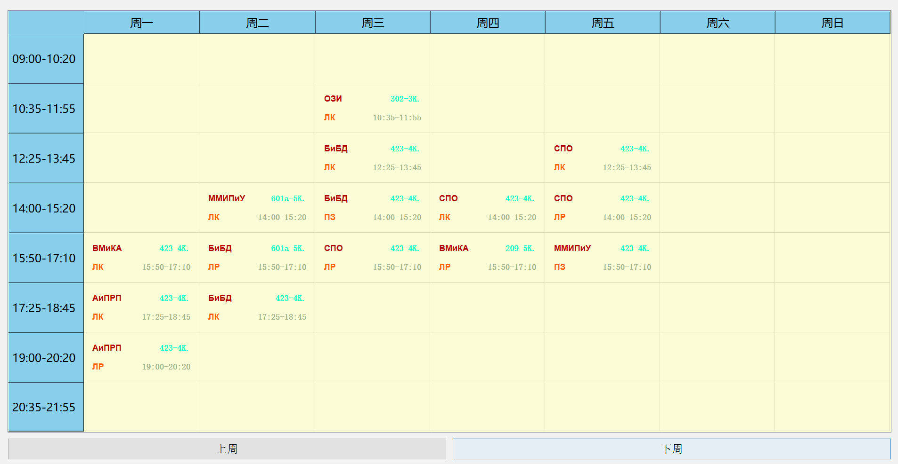

# timetable

使用爬虫和pyqt5制作的简单课表

# 项目分析（不爱写注释啊）
## 1. 第一步
### 数据获取
项目使用了 requests来获取网站的响应并且直接获取了课表的数据  
这个主要是在timetable.py里面书写了代码  
最后储存为了a.csv  
如果需要运行的话，需要先运行timetable.py  
然后更改网站地址也是在这个文件里面  
这里我使用的是白信大的网站,班级920611,网站没有什么反扒手段很简单的搞到了数据  

## 2. 第二步
### 数据的处理-周
使用了myclass.py文件
因为课表是4周一个轮回,因此将课表分别储存为了0.csv,1.csv,2.csv,3.csv,4.csv  
看数据发现有第0周 所以也搞来了

## 3. 第三步
### 数据处理-日
使用day.py文件
因为每周课表会变化，所以我直接使用了一个8(时间段)*7(星期)的二维数组储存数据  
数据使用字典保存，储存了课程名字等需要显示的信息。  
最后二维数组

## 4. 第四步
### 图形界面
使用mytimetable.py  
重写QWidget组件，设置一堆参数和样式  
主要提三个函数
1. createTable()使用QTableWidget组件来显示课表
2. mytable()使用第三步获取的数据来添加组件到QTableWidget的每一个格子。格子里面放自己写的  
MyTable类，这个类在table.py里面
3. get_current_week()获取网站信息告诉我们现在处于第几周。

# 项目运行
|包|版本|
|:---:|:---:|
|python| Python 3.7.7|
|PyQt5 |5.15.4|
|requests|2.27.1|
|pandas|1.3.5|
1. 如果自己更改数据的话
	1.  运行timetable.py获得a.csv
	2.  运行myclass.py获得0.csv,1.csv,2.csv,3.csv,4.csv
	3.  运行mytimetable.py打开图像界面
2. 使用我的数据
	1.运行mytimetable.py

# 运行效果

# 项目优化和想法
1. 首先项目可以使用Pyinstaller去打包成exe可执行文件  
2. 数据处理也考虑过数据库，
3. 然后就是加入配置文件 ,来调整一些参数的改变.
4. 图形界面上面可以加很多东西。但是目前就是先这样子了。
有兴趣做这样一个自己的时间表或者课表的可以看一看。虽然还有很多问题没有解决。代码也是一坨*。后面慢慢丰满起来。主要也就是学习巩固自己的知识.
毕竟我发现官网的课表做的比我的好看。而且功能上也比较厉害。直接看官网的不香吗。而且一般课表也是手机看。
所以欢迎各位提出意见与建议，我也只是一名在学习阶段的学生。希望能够学习更多东西。